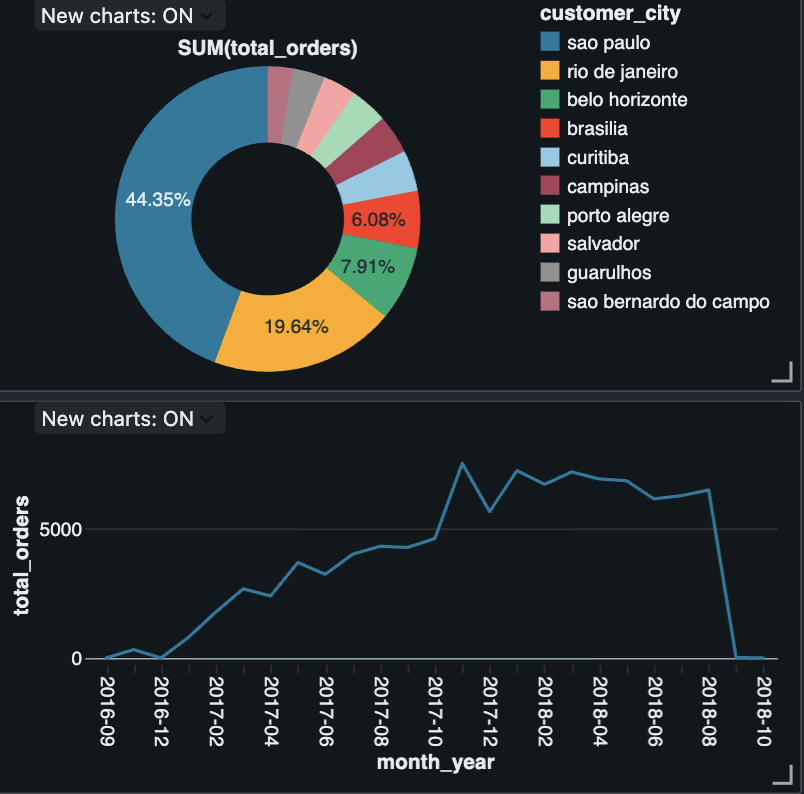

# 🚀 Olist E-Commerce End-to-End Data Pipeline

Bu proje, Brezilya'nın en büyük e-ticaret platformlarından biri olan Olist'in verilerini kullanarak oluşturulmuş, uçtan uca bir **Data Engineering** projesidir.

## 🏗️ Mimari Yapı
Proje, modern veri yığını (Modern Data Stack) prensiplerine göre inşa edilmiştir:
* **Orchestration:** Apache Airflow (Docker üzerinden)
* **Data Lakehouse:** Databricks (Medallion Architecture: Bronze, Silver, Gold)
* **Storage & Governance:** Unity Catalog & Databricks Volumes
* **Analytics:** Databricks SQL Dashboards
* **Version Control:** GitHub Integration (CI/CD Ready)

## 📊 Analytics Dashboard

*Proje kapsamında oluşturulan yönetici özeti paneli.*

## ⚙️ Pipeline Akışı
1.  **Ingestion (Bronze):** Ham CSV verileri Unity Catalog Volumes üzerinden Spark ile okunur.
2.  **Transformation (Silver):** Veri temizleme, tip dönüşümleri ve JOIN işlemleri yapılır.
3.  **Aggregation (Gold):** İş birimleri için özet tablolar (Şehir bazlı satışlar, zaman serisi analizi) hazırlanır.
4.  **Quality Checks:** Her aşamada veri tutarlılığı testleri uygulanır.

## 🛠️ Kurulum
1. `docker-compose up` ile Airflow'u ayağa kaldırın.
2. Databricks üzerinde `config/project_config` ayarlarını yapın.
3. DAG'ları tetikleyerek pipeline'ı çalıştırın.
